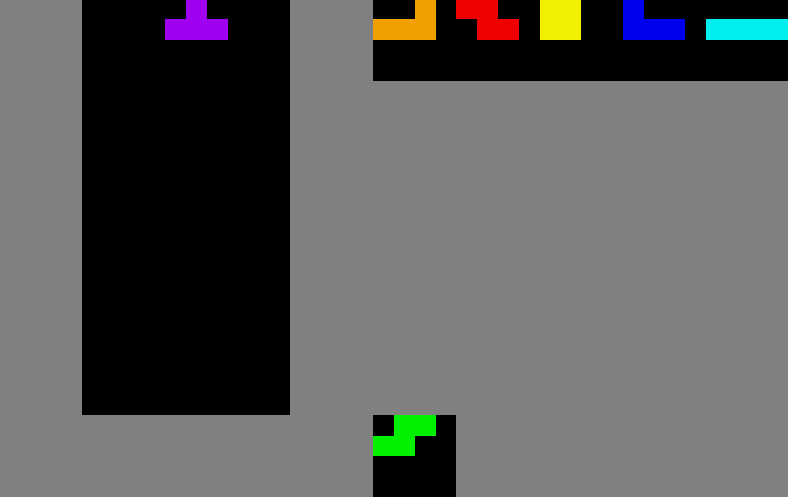

# Tetris




| Description       | Details                                                   |
|-------------------|-----------------------------------------------------------|
| Action Space      | `Discrete(8)`                                             |
| Observation Space | `Dict` containing three fields:                           |
|                   | 1. `board`: `Box (0, 9, (24, 18), uint8)`                 |
|                   | 2. `active_tetromino_mask`: `Box (0, 1, (24, 18), uint8)` |
|                   | 3. `holder`: `Box (0, 9, (4, 4), uint8)`                  |
|                   | 4. `queue`: `Box (0, 9, (4, 20), uint8)`                  |
| import            | `gymnasium.make("tetris_gymnasium/Tetris")`               |


## Description

This is the base Tetris environment. It is designed to be customizable and can be altered with Wrappers.

The base environment consists of the following components, which can all be adjusted either by using Wrappers or passing arguments to the environment constructor:

- Board: The playing field where the tetrominoes are placed.
- Holder: A place where the player can store a tetromino for later use.
- Queue: A queue of tetrominoes that will be spawned next.
- Randomizer: A component that generates the tetrominoes in the queue.
- Queue: A component that holds the tetrominoes that will be spawned next.
- Tetrominoes: The pieces that the player can move and rotate.

## Observation Space

The observation space is a dictionary containing the following elements:

- The board: 2D-array of shape `height` x `width` (padded)
  - The padding is equal to the largest tetromino in the game, which is usually the I-Tetromino, therefore 4
- The active tetromino mask: 2D-array of shape `height` x `width` (padded) indicating where the active tetromino is placed (1) and where it is not (0)
  - This information may be used during training to help the agent distinguish between the active tetromino and the board
- The holder: 1D-array of tetrominoes (padded to the same size)
- The queue: 1D-array of tetrominoes (padded to the same size)

The observation space can be altered to your needs by using [Observation wrappers](../utilities/wrappers.md).

## Actions Space

The environment supports actions as defined in the [Actions mapping](../utilities/mappings.md).

## Rewards

The environment assigns rewards based on the [Rewards mapping](../utilities/mappings.md).

## Starting state

The environment starts with an empty board and a random tetromino rendered at the top center of the board.

## Episode Termination

The episode ends, a tetromino cannot be spawned at the top of the board.

## Arguments

```{eval-rst}
.. autoclass:: tetris_gymnasium.envs.tetris.Tetris
```

### Pixels and Tetrominoes

The `base_pixels` and `tetrominoes` arguments are used to customize the very basic components of the game. To get an overview of the
meaning of these components, please refer to the dedicated section about [Tetrominoes](../components/tetromino.md).

During the initialization of the environment, the passed tetrominoes will be preprocessed. This involves changing the binary values
in the matrix to the according pixel ids. The pixel ids are later used to render the tetrominoes on the board.

The default tetrominoes and pixels are stored as constants in the environment. They are the following:

- Pixels
  - 0: Empty
  - 1: Bedrock (also used as padding / border)
- Tetrominoes
  - I, J, L, O, S, T, Z

In particular, the matrices of the default Tetrominoes (before adjusting the binary values with their respective ids) look like this:

| Tetromino | Matrix           | Tetromino | Matrix        |
|-----------|------------------|-----------|---------------|
| **I**     | `[[0, 0, 0, 0],` | **J**     | `[[1, 0, 0],` |
|           | ` [1, 1, 1, 1],` |           | ` [1, 1, 1],` |
|           | ` [0, 0, 0, 0],` |           | ` [0, 0, 0]]` |
|           | ` [0, 0, 0, 0]]` |           |               |
| **L**     | `[[0, 0, 1],`    | **O**     | `[[1, 1],`    |
|           | ` [1, 1, 1],`    |           | ` [1, 1]]`    |
|           | ` [0, 0, 0]]`    |           |               |
| **S**     | `[[0, 1, 1],`    | **T**     | `[[0, 1, 0],` |
|           | ` [1, 1, 0],`    |           | ` [1, 1, 1],` |
|           | ` [0, 0, 0]]`    |           | ` [0, 0, 0]]` |
| **Z**     | `[[1, 1, 0],`    |
|           | ` [0, 1, 1],`    |
|           | ` [0, 0, 0]]`    |
